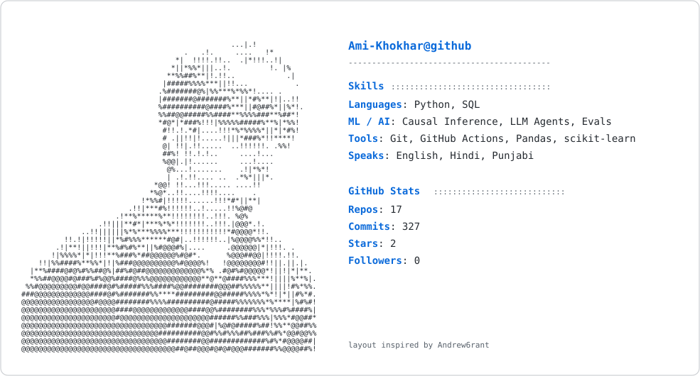

<a href="https://github.com/Ami-Khokhar">
  <picture>
    <source media="(prefers-color-scheme: dark)" srcset="dark_mode.svg" />
    
  </picture>
</a>

<!-- profile README: generated card, updated daily by GitHub Actions -->
